# Pilares de la Programación Orientada a Objetos 

Trabajo realizado por
* Mateo Miño
* Erick Villarroel
* Danny Yanacallo
-----------------------------------
# Los Cuatro Pilares de la Programación Orientada a Objetos (POO)

La Programación Orientada a Objetos (POO) se basa en cuatro conceptos fundamentales que guían la estructura y diseño de programas utilizando este paradigma. Estos pilares son:

## **Abstracción**

La **abstracción** es el proceso de simplificar y representar objetos del mundo real en forma de clases y 
objetos en el código. Permite identificar las características y comportamientos esenciales de un objeto y 
encapsularlos en una estructura coherente.

**Ejemplo:**

* Clase Vehiculo

    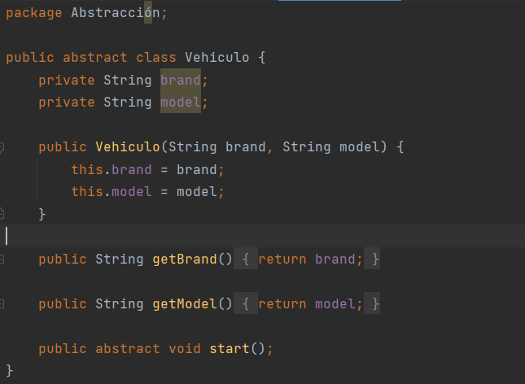

* Clase Carro

    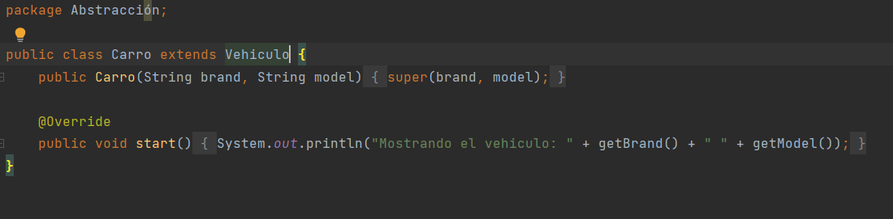

* Clase Motocicleta

    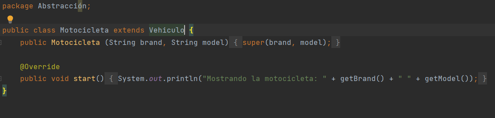

* Clase Main

    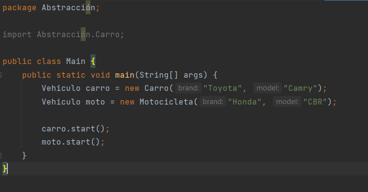

* RESULTADO

    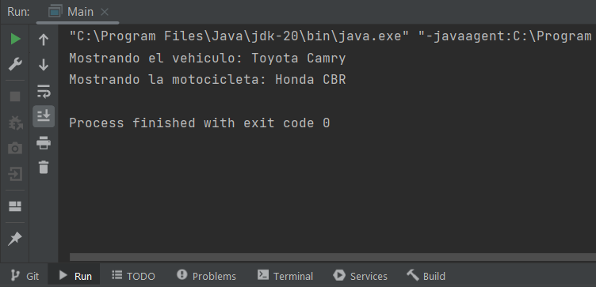

## **Encapsulación**

La **encapsulación** se refiere a la ocultación de los detalles internos de un objeto y la exposición 
controlada de su interfaz pública. Esto ayuda a prevenir el acceso no autorizado y garantiza la coherencia 
y consistencia de los datos y métodos.

**Ejemplo**

* Clase Estudiante

    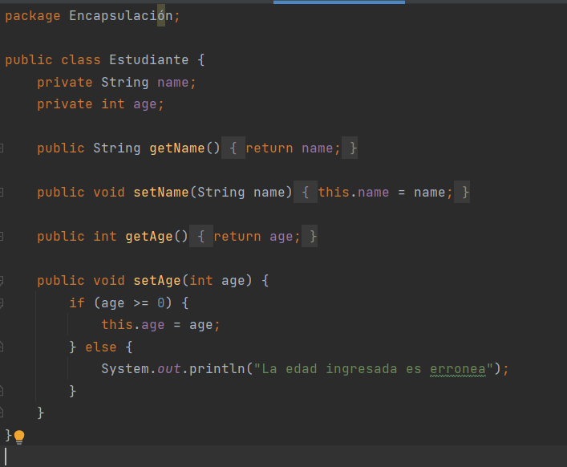

* Clase Main

    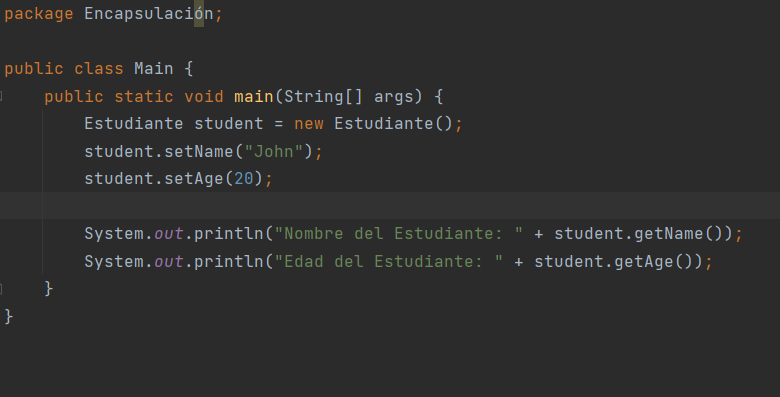

* RESULTADO

    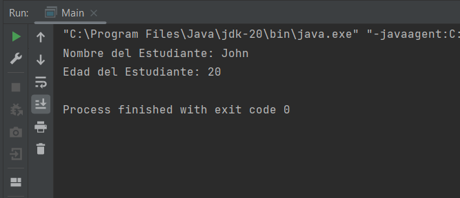

## **Herencia**

La **herencia** permite la creación de nuevas clases basadas en clases existentes, reutilizando sus 
atributos y comportamientos. Esto fomenta la jerarquía y la organización de clases en una estructura 
más general a más específica.

**Ejemplo**

* Clase Empleado

    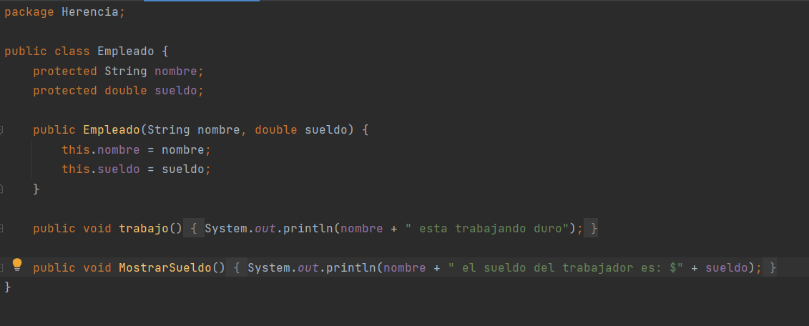

* Clase Gerente

    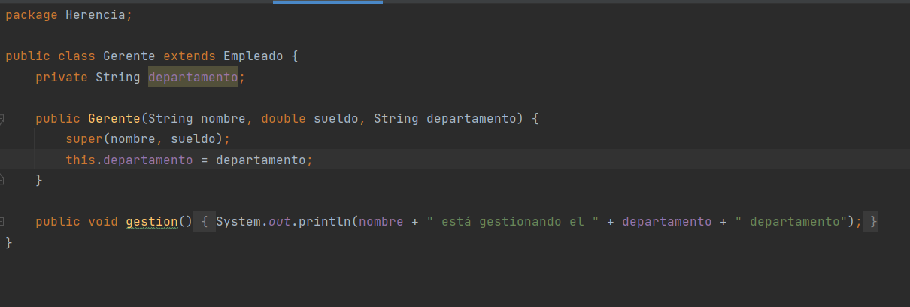

* Clase Desarrollador

    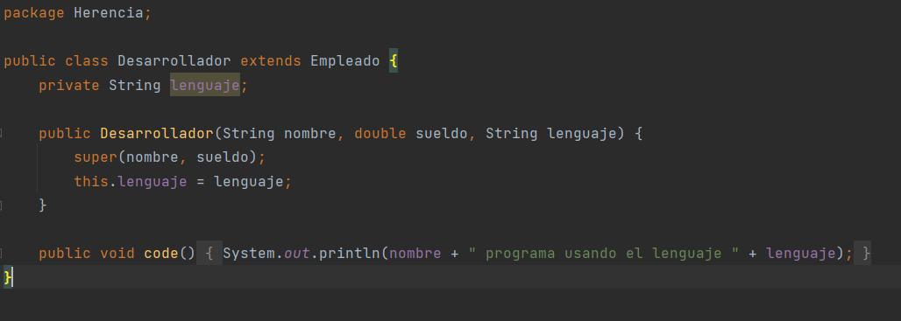

* Clase Main

    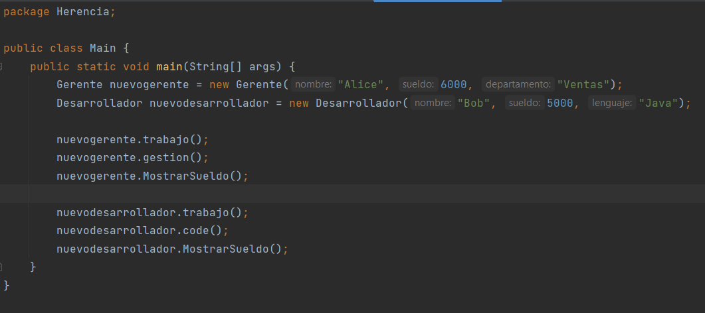

* RESULTADO

    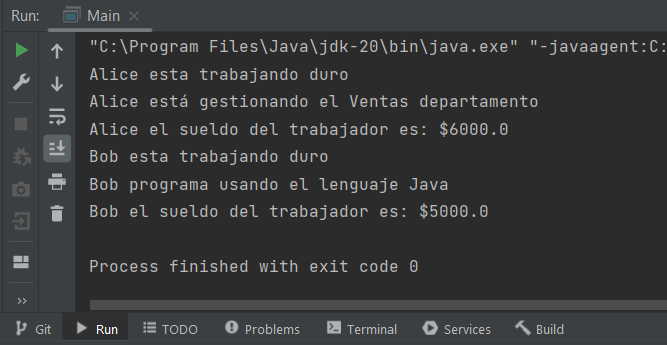

## **Polimorfismo**

El **polimorfismo** permite que objetos de diferentes clases se comporten de manera similar al 
invocar métodos con el mismo nombre, pero con implementaciones específicas en cada clase. Esto 
facilita la flexibilidad y la reutilización del código.

**Ejemplo**

* Clase Animal

    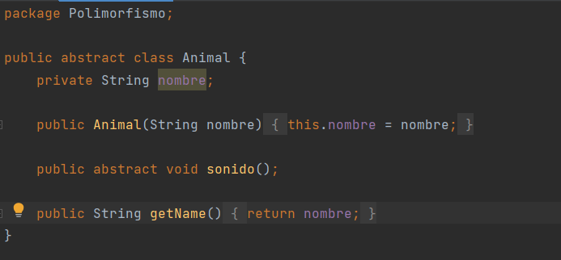

* Clase Gato

    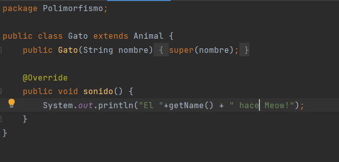

* Clase Perro

    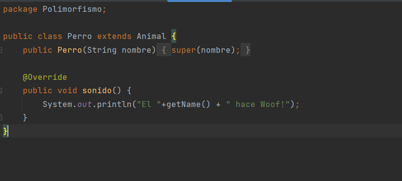

* Clase Main

    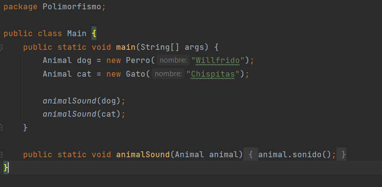

* RESULTADO

    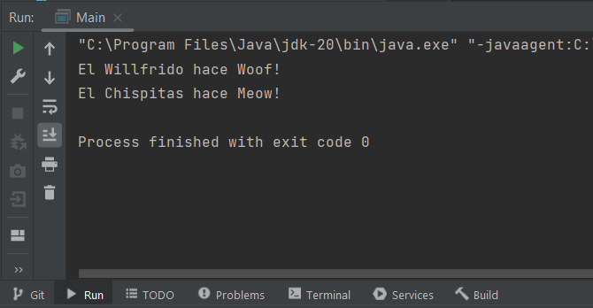

Estos cuatro pilares son los cimientos de la Programación Orientada a Objetos y proporcionan una base sólida para el diseño y desarrollo de sistemas de software más eficientes, mantenibles y escalables.
